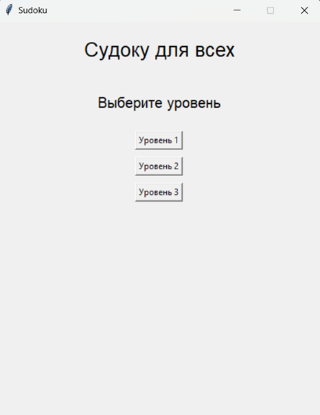
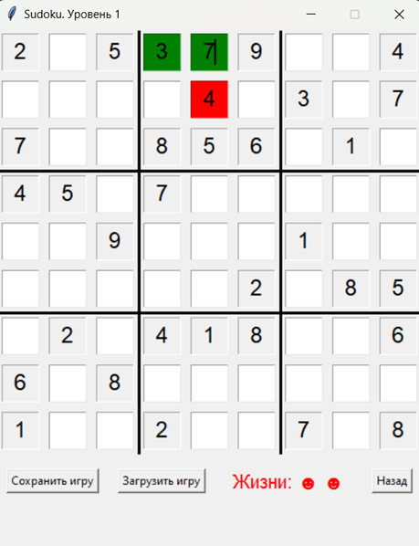

# Игра Судоку

## О проекте
Проект представляет собой графическую игру Судоку, реализованную с использованием
библиотеки Tkinter для создания интерфейса. Игра предлагает пользователю решить
стандартные задачи Судоку.

Игра содержит несколько уровней, которые пользователь может выбрать в главном меню. На
каждом уровне у игрока есть 3 жизни, то есть 3 возможности ошибиться, после чего игра
завершается, и уровень надо проходить заново. Пользователь имеет возможность сохранить
состояние уровня, позже загрузить его и продолжить с того места, где остановился.

## О программе
<b>Код содержит 3 класса:</b>

• SudokuBoard - класс, представляющий игровое поле. Предоставляет методы для
загрузки и сохранения состояния поля в JSON-файлы.

• MainMenu - главное меню игры, где пользователь может выбрать уровень. Уровни
загружаются из файловой системы, где каждый уровень представлен отдельной
директорией.

• SudokuGame - основная игровая логика, где отображается сам процесс игры.
Пользователь может взаимодействовать с полем, вводя цифры в ячейки и проверяя их
на верность. Есть кнопки для сохранения и загрузки прогресса, а также для возврата в
главное меню.

<b>Игровая логика:</b>

При каждом вводе цифры в ячейку проверяется корректность значения. Если пользователь
ввел правильное число, ячейка становится зеленой; если неверное — красной, и
уменьшается количество жизней. Если жизней не осталось, игра заканчивается.

При заполнении всех ячеек правильно появляется сообщение о победе. В случае окончания
жизней игроку показывается сообщение о проигрыше.

| Меню                | Игровой процесс         |
|---------------------|-------------------------|
|  |  |